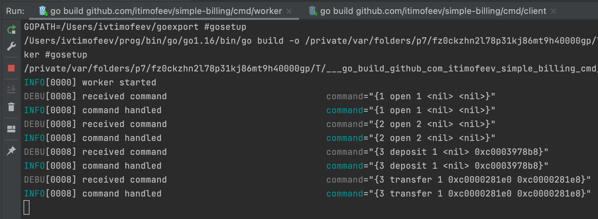
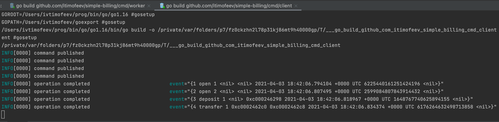
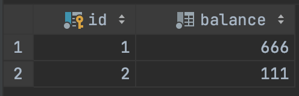

# Тестовое задание Billing: Микросервис баланса пользователей

## Задача
Приложение хранит в себе идентификаторы пользователей и их баланс. Взаимодействие с ним осуществляется исключительно с помощью брокера очередей.

По требованию внешней системы, микросервис может выполнить одну из следующих операций со счетом пользователя:
- Списание
- Зачисление
- Перевод от пользователя к пользователю
- (будет плюсом, но не обязательно) Блокирование с последующим списанием или разблокированием. Заблокированные средства недоступны для использования. Блокировка означает что некая операция находится на авторизации и ждет какого-то внешнего подтверждения, ее можно впоследствии подтвердить или отклонить

После проведения любой из этих операций генерируется событие-ответ в одну из очередей.

Основные требования к воркерам:
- Код воркеров должен безопасно выполняться параллельно в разных процессах
- Воркеры могут запускаться одновременно в любом числе экземпляров и выполняться произвольное время
- Все операции должны обрабатываться корректно, без двойных списаний, отрицательный баланс не допускается

В пояснительной записке к выполненному заданию необходимо указать перечень используемых инструментов и технологий, способ развертки приложения, общий механизм работы (интерфейсы ввода/вывода)

Будет плюсом покрытие кода юнит-тестами.

Требования к окружению:
- Язык программирования: PHP 7 (PSR-2) либо Go 1.10+
- Можно использовать: любые фреймворки, реляционные БД для хранения баланса, брокеры очередей, key-value хранилища.

## Технологии
- go 1.16
- docker
- postgres:13 в качестве базы данных
- NATA Streaming в качестве очереди с гарантией доставки "At least once"

## Тесты
- `make run-env` запустить окружение (в докере поднимутся контейнеры с базой и с очередью)
- `make test` запустит тесты

В файле internal/app/service/load_test.go есть нагрузочный тест, который проверяет отсутствие двойных списаний

## Поиграться
- `make run-env` запустить окружение
- `go run cmd/worker/main.go` запустить воркер, он подпишется на события из натса с входящими командами
- отредактировать файлик `cmd/client/main` так, чтобы он отправлял нужные вам команды
- запустить `go run cmd/client/main.go` в отдельной консольке
- PROFIT!!1!

Дефолтный код клиента отправляет 4 команды в воркер:
1. создать аккаунт для пользователя 1
2. создать аккаунт для пользователя 2
3. зачислить 777 на аккаунт 1
4. перевести 111 с 1 на 2

В результате получается ожидаемый результат.

Worker:

получил и обработал 4 команды

Client:

отправил 4 команды и прочитал 4 ответных сообщения

Содержимое БД:

## Что можно было бы доработать, но лень :)
1. Блокировку средств с последующей разблокировкой или отменой.
Нужно было бы в отдельной таблице вести лог блокировок.
В таблице `balances` нужно было бы добавить ещё одно поле, которое хранило бы заблокированную сумму. Поскольку перед обновлением баланса мы лочим строку (`FOR UPDATE`), то достаточно легко добавить проверку на доступный баланс.
2. Всякие логи и метрики
3. В сообщение об обработке входящей команды можно было бы отправлять id команды, чтобы клиент мог сопоставить результат с запросом
4. Отправлять сообщение, если в результате обработки команды произошла ошибка
5. Написать docker-compose, в котором задеплоить несколько инстансов worker. Они бы работали параллельно, т.к. stateless, а всё состояние хранится в базе. Работа с этим состоянием реализована безопасным образом с точки зрения одновременной работы нескольких воркеров.
6. cron, досылающий сообщения, которые записались в БД, но не отправились в очередь (`events.queue_sent_time IS NULL and events.created_time < now() - '1 minute'`) из-за падения, например.

